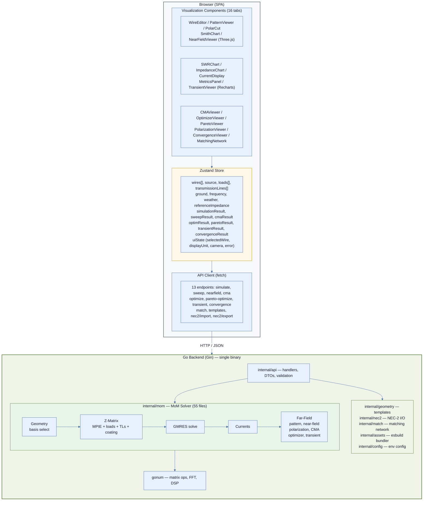

# VE3KSM Antenna Studio — Architecture & Design Document

## 1. Executive Summary

VE3KSM Antenna Studio is a professional-grade web-based antenna design and simulation platform built on the **Method of Moments (MoM)** electromagnetic solver. Users define wire antenna geometries through an interactive 3D editor and tabular input, then run simulations and explore results across 16 visualization panels covering radiation patterns, impedance, SWR, near-field, polarization, Characteristic Mode Analysis (CMA), time-domain transient response, PSO and Pareto optimization, and impedance matching network design.

The system is a monorepo with two primary components:
- **Frontend**: React 18 SPA with Three.js for 3D visualization, Recharts for 2D plots, and Zustand for state management
- **Backend**: Go HTTP server (Gin) hosting a pure-Go MoM solver. The Go binary compiles the TypeScript frontend **in-process** via the esbuild Go library — there is no Node.js, Vite, or nginx in the runtime path

Key solver capabilities: thin-wire MoM (triangle/sinusoidal/quadratic basis), free-space and lossy ground (Fresnel/Sommerfeld), per-wire dielectric coating and conductor skin-effect loss, global weather film, lumped R/L/C loads, 2-port transmission lines, NEC-2 import/export, impedance matching network designer (L/pi/T/gamma/beta/toroid), near-field E/H computation, CMA, PSO single-objective and NSGA-II multi-objective optimization, time-domain transient via IFFT, mesh convergence testing, and fast interpolated frequency sweeps.

---

## 2. System Architecture

### 2.1 High-Level Diagram



### 2.2 Communication Protocol

All frontend-backend communication is **synchronous HTTP REST** (JSON request/response). WebSocket is reserved as a future option for long-running simulations with progress reporting.

| Aspect | Decision |
|---|---|
| Protocol | HTTP/1.1 (upgrade to HTTP/2 via reverse proxy) |
| Serialization | JSON |
| CORS | Configured via `CORS_ORIGINS` env var; frontend and backend share the same origin (`:8080`) so CORS is not needed in typical dev/prod use |
| Timeout | 30s default; frequency sweeps may take longer, so the sweep endpoint uses 120s |

---

## 3. Backend Architecture (Go)

### 3.1 Package Layout

```
backend/
├── cmd/
│   ├── server/
│   │   └── main.go              # Entry point: Gin router, esbuild bundler, 13 API routes
│   └── ituimport/
│       ├── main.go              # CLI tool: import ITU-R P.832 ground region presets
│       └── main_test.go
├── internal/
│   ├── api/
│   │   ├── handlers.go          # All HTTP handlers (Simulate, Sweep, NearField, CMA,
│   │   │                        #   Optimize, ParetoOptimize, Transient, Convergence,
│   │   │                        #   Match, Templates, NEC2Import/Export)
│   │   ├── middleware.go        # CORS, request logging
│   │   ├── request.go           # Request DTOs + semantic validation
│   │   ├── response.go          # Response DTOs + camelCase serialization helpers
│   │   ├── nec2.go              # NEC-2 import/export handler wrappers
│   │   ├── match.go             # Matching network handler wrapper
│   │   └── api_test.go          # Integration tests
│   ├── geometry/
│   │   ├── wire.go              # Wire geometry helpers
│   │   ├── ground.go            # Ground preset helpers
│   │   ├── templates.go         # 5 preset antenna generators (dipole, Yagi, vertical, loop, inv-V)
│   │   └── geometry_test.go
│   ├── mom/                     # Core MoM solver — 55 Go files, ~12 300 lines
│   │   ├── types.go             # All solver types (SimulationInput, Wire, Load, TL, WeatherConfig,
│   │   │                        #   SolverResult, SweepResult, OptimResult, ParetoResult, …)
│   │   ├── solver.go            # Main pipeline: basis select → Z-matrix → GMRES → results
│   │   ├── segment.go           # Wire → segment subdivision
│   │   ├── basis.go             # Basis function families (triangle, sinusoidal, quadratic)
│   │   ├── green.go             # Green's function kernel (MPIE)
│   │   ├── gen_kernel.go        # Thin-wire kernel evaluation
│   │   ├── quadrature.go        # Gauss-Legendre numerical integration
│   │   ├── zmatrix.go           # Z-matrix assembly orchestration
│   │   ├── zmat_setter.go       # Matrix operation interface
│   │   ├── gmres.go             # GMRES iterative linear solver with restarts
│   │   ├── farfield.go          # Far-field E(θ,φ), gain, polar cuts
│   │   ├── nearfield.go         # Near-field E/H on 2D observation grid
│   │   ├── metrics.go           # F/B ratio, beamwidth, sidelobe, efficiency
│   │   ├── polarization.go      # Axial ratio, tilt angle, sense (RHCP/LHCP)
│   │   ├── ground_image.go      # Image-method orchestration
│   │   ├── ground_real.go       # Lossy ground: Fresnel + Sommerfeld
│   │   ├── ground_complex_image.go  # Complex image-point summation
│   │   ├── material.go          # Conductor materials + skin-effect loss (Rs)
│   │   ├── coating.go           # Dielectric coating: IS-card multi-layer formula
│   │   ├── load.go              # Lumped R/L/C loads (LD-card equivalent)
│   │   ├── transmission_line.go # 2-port lossy TL elements and stubs
│   │   ├── reflection.go        # Reflection coefficient + VSWR
│   │   ├── spline.go            # Cubic spline for sweep interpolation
│   │   ├── sweep_interpolated.go # Fast sweep: exact anchors + spline fill
│   │   ├── transient.go         # Time-domain: freq sweep → IFFT → waveform
│   │   ├── cma.go               # Characteristic Mode Analysis (eigendecomp)
│   │   ├── convergence.go       # Mesh refinement convergence (1x vs 2x)
│   │   ├── optimizer.go         # PSO single-objective optimizer
│   │   ├── pareto.go            # NSGA-II multi-objective Pareto optimizer
│   │   ├── validate.go          # Input geometry validation
│   │   └── *_test.go            # Per-file test suites
│   ├── nec2/
│   │   ├── doc.go               # Supported NEC-2 card subset (GW, GS, GE, GN, LD, TL, EX, FR, EN)
│   │   ├── parse.go             # NEC-2 deck parser (free-format + fixed-column tolerant)
│   │   ├── from_input.go        # SimulationInput → NEC-2 wire geometry
│   │   ├── convert.go           # NEC-2 deck → SimulationInput
│   │   ├── write.go             # Export antenna as NEC-2 deck
│   │   └── nec2_test.go         # Round-trip parser/writer tests
│   ├── match/
│   │   ├── match.go             # Closed-form matching: L, pi, T, gamma, beta, toroid
│   │   ├── topologies.go        # Individual topology solvers
│   │   ├── toroid.go            # Toroid core database + selection
│   │   └── match_test.go
│   ├── assets/
│   │   ├── bundler.go           # esbuild in-process TypeScript bundler
│   │   ├── handler.go           # Asset serving + SPA fallback
│   │   └── html.go              # HTML template injection
│   └── config/
│       ├── config.go            # Server config: PORT, CORS_ORIGINS
│       └── config_test.go
├── go.mod
└── go.sum
```

### 3.2 Solver Pipeline — Detailed Flow

```mermaid
%%{init: {'theme': 'base', 'themeVariables': {'primaryColor': '#e8f0fe', 'primaryTextColor': '#1a1a2e', 'primaryBorderColor': '#4a6fa5', 'lineColor': '#4a6fa5', 'background': '#ffffff', 'nodeBorder': '#4a6fa5', 'edgeLabelBackground': '#ffffff'}}}%%
flowchart TD
    IN(["SimulateRequest"])
    V1["1. Validate Geometry<br/>Wire lengths > 0, radius > 0<br/>Segments ≥ 1, valid source<br/>Thin-wire approximation check"]
    V2["2. Subdivide Wires<br/>Each wire → N segments<br/>center, endpoints, half-length, direction"]
    V3["3. Select Basis Functions<br/>triangle (rooftop, default)<br/>sinusoidal (King-type, 3–5× fewer unknowns)<br/>quadratic (Hermite, smooth)"]
    V4["4. Build Z-Matrix (M × M)<br/>MPIE: vector potential (∫∫ψ) + scalar potential<br/>Gauss-Legendre quadrature (8–16 pt)<br/>Self-terms: reduced kernel<br/>Parallel goroutine worker pool"]
    V4L["Stamp conductor loss (material Rs)<br/>+ dielectric coating (IS-card Zs)<br/>+ weather film (outer layer Zs)<br/>+ lumped loads (LD diagonal)<br/>+ transmission lines (2-port Zmat)"]
    V4G{"Ground<br/>type?"}
    V4I["Add image contributions<br/>perfect: unity reflection<br/>real: Fresnel Rv/Rh coefficients<br/>complex image: Sommerfeld summation"]
    V5["5. Build V Vector<br/>V = [0, …, Vs, …, 0]<br/>Vs at feed basis node"]
    V6["6. GMRES Solve: Z·I = V<br/>Iterative solver with restarts<br/>→ complex current coefficients"]
    V7["7. Compute Results<br/>a) Z_in = Vs / I_feed<br/>b) SWR = (1+|Γ|) / (1−|Γ|)<br/>c) Far-field E(θ,φ) on 2° grid<br/>d) Gain/metrics/polarization/cuts<br/>e) Accuracy warnings"]
    OUT(["SimulateResponse"])

    IN --> V1 --> V2 --> V3 --> V4
    V4 --> V4L --> V4G
    V4G -->|"perfect / real"| V4I --> V5
    V4G -->|"free_space"| V5
    V5 --> V6 --> V7 --> OUT

    style IN fill:#fff8e8,stroke:#c4950a,color:#1a1a2e
    style OUT fill:#eaf5ea,stroke:#5a7a3a,color:#1a1a2e
    style V1 fill:#fef0f0,stroke:#c44a4a,color:#1a1a2e
    style V2 fill:#e8f0fe,stroke:#4a6fa5,color:#1a1a2e
    style V3 fill:#e8f0fe,stroke:#4a6fa5,color:#1a1a2e
    style V4 fill:#e8f0fe,stroke:#4a6fa5,color:#1a1a2e
    style V4L fill:#f0f4e8,stroke:#5a7a3a,color:#1a1a2e
    style V4G fill:#fff8e8,stroke:#c4950a,color:#1a1a2e
    style V4I fill:#f0f4e8,stroke:#5a7a3a,color:#1a1a2e
    style V5 fill:#e8f0fe,stroke:#4a6fa5,color:#1a1a2e
    style V6 fill:#f3e8fe,stroke:#7a4aa5,color:#1a1a2e
    style V7 fill:#eaf5ea,stroke:#5a7a3a,color:#1a1a2e
```



### 3.3 Core Data Structures

```go
// mom/types.go — canonical source of truth

// SimulationInput — full input for a single-frequency MoM run
type SimulationInput struct {
    Wires              []Wire
    Frequency          float64       // Hz
    Ground             GroundConfig
    Source             Source
    Loads              []Load        // optional lumped R/L/C loads
    TransmissionLines  []TransmissionLine
    ReferenceImpedance float64       // Z₀ for SWR/Γ (default 50 Ω)
    BasisOrder         BasisOrder    // "triangle" | "sinusoidal" | "quadratic"
    Weather            WeatherConfig
}

// Wire — a straight conductor segment in the antenna geometry
type Wire struct {
    X1, Y1, Z1       float64      // start point (m)
    X2, Y2, Z2       float64      // end point (m)
    Radius           float64      // wire radius (m)
    Segments         int          // MoM discretization count
    Material         MaterialName // "copper" | "aluminum" | "brass" | … | "" (PEC)
    CoatingThickness float64      // dielectric coating outer thickness (m)
    CoatingEpsR      float64      // coating relative permittivity (εr)
    CoatingLossTan   float64      // coating loss tangent (tanδ)
}

// Load — lumped R/L/C element (NEC LD-card equivalent)
type Load struct {
    WireIndex    int          // which wire
    SegmentIndex int          // which segment on that wire
    Topology     LoadTopology // "series_rlc" | "parallel_rlc"
    R            float64      // resistance (Ω)
    L            float64      // inductance (H)
    C            float64      // capacitance (F)
}

// TransmissionLine — 2-port lossy TL (NEC TL-card equivalent)
type TransmissionLine struct {
    A, B           TLEnd   // port endpoints (wire_index, segment_index; -1/-2 = shorted/open stub)
    Z0             float64 // characteristic impedance (Ω)
    Length         float64 // physical length (m)
    VelocityFactor float64 // velocity factor (0–1)
    LossDbPerM     float64 // conductor loss (dB/m)
}

// WeatherConfig — global dielectric film on every wire (outer layer)
type WeatherConfig struct {
    Preset    string  // "dry" | "rain" | "ice" | "wet_snow"
    Thickness float64 // film thickness (m)
    EpsR      float64 // εr override (> 0 overrides preset)
    LossTan   float64 // tanδ override (used when EpsR > 0)
}

// GroundConfig — ground plane configuration
type GroundConfig struct {
    Type           string  // "free_space" | "perfect" | "real"
    Conductivity   float64 // S/m ("real" only)
    Permittivity   float64 // relative εr ("real" only)
    MoisturePreset string  // informational label; εr/σ are authoritative
    RegionPreset   string  // informational label (e.g. "itu:3")
}

// Source — voltage excitation point
type Source struct {
    WireIndex    int        // wire array index
    SegmentIndex int        // segment index on that wire (0-based)
    Voltage      complex128 // defaults to 1+0j
}
```

```go
// SolverResult — full output of a single-frequency simulation
type SolverResult struct {
    Currents           []CurrentEntry
    Impedance          ComplexImpedance
    SWR                float64
    ReferenceImpedance float64
    GainDBi            float64
    Pattern            []PatternPoint
    Metrics            FarFieldMetrics     // F/B, beamwidth, sidelobe, efficiency
    Cuts               PolarCuts           // azimuth & elevation 2D cuts
    Polarization       PolarizationMetrics // axial ratio, tilt, RHCP/LHCP
    Warnings           []Warning
}
```

```go
// mom/segment.go
type Segment struct {
    Index      int        // global segment index
    WireIndex  int        // source wire
    Center     [3]float64 // midpoint (m)
    Start      [3]float64 // segment start
    End        [3]float64 // segment end
    HalfLength float64    // Δ/2
    Direction  [3]float64 // unit vector along wire
    Radius     float64    // wire radius (m)
}
```

### 3.4 Z-Matrix Assembly — Algorithm Detail

The impedance matrix uses the **Mixed Potential Integral Equation (MPIE)** with **triangle (rooftop) basis functions**. Triangle basis was chosen over pulse basis because pulse basis creates delta-function charges at segment endpoints that produce divergent self-potentials for thin wires, making the impedance matrix ill-conditioned.

Each matrix element `Z[m][n]` between triangle basis functions `m` and `n` is:

```
Z[m][n] = jωμ/(4π) · A_mn  +  1/(jωε·4π) · Φ_mn
```

**Vector potential term** (A_mn):
```
A_mn = Σ_{a∈m} Σ_{b∈n} (ŝa·ŝb) ∫∫ φ_m(s)·φ_n(s')·ψ(R) ds ds'
```

**Scalar potential term** (Φ_mn):
```
Φ_mn = Σ_{a∈m} Σ_{b∈n} ρ_a·ρ_b ∫∫ ψ(R) ds ds'
```

Where:
- `ψ(R) = e^{-jkR} / R` is the reduced Green's function
- `φ_m, φ_n` are piecewise-linear current shape functions (triangle basis)
- `ρ_a, ρ_b` are piecewise-constant charge densities (`±1/Δl`)
- The sums are over the 1–2 segments that each basis function spans

**Implementation approach**:
1. Each basis function spans up to 2 segments → up to 4 segment-pair integrals per `Z[m][n]`
2. Double Gauss-Legendre quadrature per segment pair (8 points standard, 16 for self-terms)
3. **Self-terms**: use reduced kernel `R = sqrt(r² + a²)` where `a` = wire radius
4. **Parallelization**: goroutine worker pool (`runtime.NumCPU()` workers) fills the matrix concurrently

### 3.5 Far-Field Computation

For each angular sample point `(θ, φ)`:

```
E(θ,φ) = Σᵢ Iᵢ · Δlᵢ · ŝᵢ × (ŝᵢ × r̂) · e^{jk(r̂·rᵢ)} · (-jωμ/4πr)
```

Simplification: compute on a unit sphere (`r = 1`, drop the `1/r` for pattern shape).

**Angular grid**: Default to 2° resolution → 91 θ values × 181 φ values = 16,471 points. Return as a flat array of `PatternPoint` structs for the frontend to render.

**Ground plane**: For any non-free-space ground, the pattern is restricted to the upper hemisphere (θ ≤ 90°). Image segment contributions are added to the far-field sum:
- **Perfect ground** (`ComputeFarFieldWithGround`): image contributes with unity reflection coefficient. Total power = upper hemisphere integral only (no doubling — the image field already appears in the upper hemisphere).
- **Real ground** (`ComputeFarFieldRealGround`): image contributions scaled by angle-dependent Fresnel reflection coefficients Rv (vertical) and Rh (horizontal), blended by current orientation. Lossy ground absorbs power, so total power = upper hemisphere integral without doubling.

### 3.6 Frequency Sweep

The `/api/sweep` endpoint repeats the full solver pipeline for each frequency step:

```
for each freq in linspace(freq_start, freq_end, freq_steps):
    k = 2π·freq / c
    rebuild Z-matrix (frequency-dependent via k)
    solve Z·I = V
    compute impedance, SWR at this freq
```

**Optimization**: The geometry and segmentation are frequency-independent — only rebuild them once. The Z-matrix must be rebuilt at each frequency because the Green's function depends on `k`.

**Parallelization**: Each frequency point is independent. Use a goroutine worker pool to solve multiple frequencies concurrently. For 50 frequency steps on an 8-core machine, expect ~6x speedup.

### 3.7 Ground Plane Implementation

#### Phase 1: Perfect Ground (Image Theory)

For a perfect ground at `z = 0`:
- For every real segment at position `(x, y, z)`, create an image segment at `(x, y, -z)`
- Image currents are inverted for horizontal components, preserved for vertical
- Add image segment contributions to the Z-matrix (doubles the integration work, but no additional unknowns)

#### Phase 2: Real (Lossy) Ground — Fresnel Reflection Coefficients

Implemented using the **reflection-coefficient image method** (same approach as MININEC/EZNEC). Instead of full Sommerfeld integration, each image contribution is scaled by an angle-dependent Fresnel coefficient:

**Complex permittivity**: `εc = εr − jσ/(ωε₀)`

**Fresnel coefficients** at grazing angle ψ:
- Vertical (TM): `Rv = (εc·sinψ − √(εc − cos²ψ)) / (εc·sinψ + √(εc − cos²ψ))`
- Horizontal (TE): `Rh = (sinψ − √(εc − cos²ψ)) / (sinψ + √(εc − cos²ψ))`

**Z-matrix** (`addRealGroundTriangleBasis`): computes the quasi-static angle from the source-image geometry, blends Rv/Rh by current orientation, and scales the image kernel contribution by the effective reflection coefficient.

**Far-field** (`ComputeFarFieldRealGround`): applies per-angle Fresnel coefficients to image segment contributions, with ψ = π/2 − θ.

**Limits**: approaches perfect ground as σ → ∞ (validated in tests). Less accurate for horizontal wires within λ/10 of the ground surface.

### 3.8 Wire Loading & Conductor Materials

Three independent loading mechanisms stack onto the Z-matrix diagonal:

**Conductor skin-effect loss** (`material.go`): 8 built-in conductors (copper, aluminum, brass, steel, stainless, silver, gold). Surface resistance `Rs = √(πfμσ)` distributed over each segment basis function. Selected per wire via `Wire.Material`; empty string = perfect conductor (no loss).

**Per-wire dielectric coating** (`coating.go`): Implements the NEC-4 IS-card multi-layer model. A dielectric shell of thickness `CoatingThickness` (εr = `CoatingEpsR`, tanδ = `CoatingLossTan`) around the wire conductor adds a distributed series impedance per segment:

```
Z'_coating = (jωμ₀/2π) · (1/ε₀ − 1/ε_coat*) · ln(b / a)
```

where `a` = wire radius, `b` = outer coating radius, `ε_coat*` = complex permittivity.

**Global weather film** (`coating.go`, `WeatherConfig`): An outer dielectric film applied on top of every wire (stacked outside any per-wire coating). Presets:

| Preset | εr | tanδ | Typical use |
|--------|-----|------|-------------|
| `dry` | — | — | No film (default) |
| `rain` | 80 | 0.05 | Heavy rainfall |
| `ice` | 3.17 | 0.001 | Ice accretion |
| `wet_snow` | 1.6 | 0.005 | Wet snow load |

Custom εr/tanδ can be specified directly.

### 3.9 Impedance Matching Network Designer

`internal/match/` computes closed-form passive matching networks to transform the simulated antenna impedance to the transmitter Z₀ (typically 50 Ω).

| Topology | Elements | Notes |
|----------|----------|-------|
| L-network | 2 reactive | 4 auto-configurations (low/high-pass, series/shunt) |
| Pi-network | 3 (shunt-series-shunt) | Q-based design |
| T-network | 3 (series-shunt-series) | Q-based design |
| Gamma match | series C + tap | Yagi driven-element match |
| Beta/hairpin | shunt L + series C | Coaxial balun style |
| Toroidal transformer | core + windings | Core selected from AL-value database |

Input: load impedance R+jX and source Z₀. Output: component values, resonant frequencies, E12 nearest standard values, and (for toroid) core name, AL index, and turn counts.

### 3.10 NEC-2 Import/Export

`internal/nec2/` provides full round-trip NEC-2 file I/O. Supported card subset:

| Card | Function |
|------|---------|
| `GW` | Wire geometry |
| `GS` | Scale factor |
| `GE` | Geometry end |
| `GN` | Ground definition |
| `LD` | Lumped loads |
| `TL` | Transmission lines |
| `EX` | Voltage excitation |
| `FR` | Frequency |
| `CM`/`CE` | Comments |
| `EN` | End of deck |

`parse.go` handles both free-format and fixed-column-width NEC-2 decks. `write.go` exports the current antenna model including frequency sweep information. `convert.go` maps NEC-2 concepts to `SimulationInput` fields.

### 3.11 Advanced Analysis Modes

Beyond the core simulate/sweep pipeline, the following analyses are available via dedicated API endpoints:

**Near-field** (`nearfield.go`, `POST /api/nearfield`): Computes E and H field magnitudes on a configurable 2D Cartesian observation grid (XY, XZ, or YZ plane). Grid range and resolution are user-specified. Uses full Lorentz reciprocity integration over all segments.

**Polarization analysis** (`polarization.go`, included in simulate response): Decomposes the radiated field into E_θ and E_φ components at each pattern point. Reports axial ratio, tilt angle, and polarization sense (RHCP/LHCP) across the upper hemisphere.

**Characteristic Mode Analysis** (`cma.go`, `POST /api/cma`): Performs eigendecomposition of the imaginary part of the impedance matrix (source-free). Returns eigenvalues, mode significance, and per-mode current distributions to reveal the antenna's natural resonant behaviour independent of excitation.

**Transient time-domain response** (`transient.go`, `POST /api/transient`): Computes the time-domain impulse response via frequency sweep → complex transfer function → IFFT. Supports three excitation pulse shapes (Gaussian, step, modulated Gaussian) and three transfer functions (reflection coefficient, input voltage, feed current). Output: time-domain waveform, excitation pulse, and metrics (peak time, ringdown, FWHM).

**Convergence testing** (`convergence.go`, `POST /api/convergence`): Runs the solver at 1× and 2× the specified segmentation count. Reports relative delta in impedance, SWR, and gain. Used to verify mesh density is adequate (small delta = converged solution).

### 3.12 Optimizer Subsystem

**PSO single-objective** (`optimizer.go`, `POST /api/optimize`): Tunes wire geometry variables to minimize a weighted sum of antenna metrics.

- *Variables*: any combination of wire endpoint coordinates (x1–z2) and radius
- *Goals*: SWR, gain, front-to-back ratio, impedance R/X, radiation efficiency, beamwidth
- *Objective*: `cost = Σ weight_i · |metric_i − target_i|`
- *Hyper-parameters*: 20 particles, 40 iterations (configurable)
- *Output*: best parameter set, best cost, per-metric values, convergence curve

**NSGA-II multi-objective Pareto** (`pareto.go`, `POST /api/pareto-optimize`): Simultaneously optimises multiple independent (possibly conflicting) objectives. Returns the full Pareto front of non-dominated trade-off designs, not a single best.

- *Objectives*: any metrics with `minimize` or `maximize` direction
- *Algorithm*: non-dominated sorting + crowding-distance selection
- *Hyper-parameters*: 40 population, 30 generations (configurable)
- *Output*: ranked Pareto front with objective values per solution

### 3.13 Interpolated Frequency Sweep

`sweep_interpolated.go` accelerates frequency sweeps by solving the full Z-matrix only at a sparse set of anchor frequencies and using cubic spline interpolation for intermediate points.

- **Exact mode**: full GMRES solve at every requested frequency
- **Interpolated mode**: anchor solve + spline fill (10–50× faster for 50+ steps)
- **Auto mode**: switches to interpolated when `freq_steps > 32`
- **Accuracy**: spline error typically < 0.1% for smooth impedance curves; accuracy warnings are emitted if the interpolation deviation is large

The sweep mode is selected via `SweepMode` in the sweep request.

---

## 4. Frontend Architecture (React)

### 4.1 Component Tree

```
<App>
├── <Header>
│   ├── <TemplateSelector>          # Dropdown: Dipole, Yagi, Vertical, Inv-V, Loop
│   ├── <SaveButton>                # Export full design as JSON
│   ├── <LoadButton>                # Import design from JSON
│   ├── <NEC2ImportButton>          # Import .nec deck via backend parser
│   ├── <NEC2ExportButton>          # Export current model as .nec deck
│   ├── <SimulateButton>            # Single-frequency MoM simulation
│   └── <SweepButton>               # Frequency sweep
│
├── <MainLayout>                     # Resizable split panels with collapse toggle
│   ├── <LeftPanel>                  # Scrollable input forms (~380 px default)
│   │   ├── <WireTable>             # Tabular wire editor with unit selector (m/ft/in/cm/mm)
│   │   │   ├── <WireRow>           # Material + coating + geometry fields per wire
│   │   │   └── <AddWireButton>
│   │   ├── <SourceConfig>          # Feed point: wire index, segment
│   │   ├── <LoadEditor>            # Add/edit/remove lumped R/L/C loads
│   │   ├── <TLEditor>              # Transmission line and stub configuration
│   │   ├── <GroundConfig>          # Ground type, soil moisture presets, ITU zone map picker
│   │   │   └── <RegionMapPicker>   # ITU-R P.832 world map for ground preset selection
│   │   ├── <WeatherPanel>          # Global weather film (rain/ice/wet_snow or custom)
│   │   └── <FrequencyInput>        # Single/sweep mode + basis-order selector
│   │
│   └── <RightPanel>                 # Tabbed visualization area (16 tabs)
│       ├── <Tab: 3D Editor>
│       │   └── <WireEditor>        # Three.js interactive geometry editor (Z-up)
│       ├── <Tab: 3D Pattern>
│       │   └── <PatternViewer>     # 3D radiation pattern mesh, persisted camera
│       ├── <Tab: Polar Cuts>
│       │   └── <PolarCut>          # 2D SVG azimuth / elevation principal-plane cuts
│       ├── <Tab: Smith Chart>
│       │   └── <SmithChart>        # SVG reflection-coefficient locus, sweep trace
│       ├── <Tab: Metrics>
│       │   └── <MetricsPanel>      # Peak gain, F/B, beamwidth, efficiency, radiated power
│       ├── <Tab: SWR>
│       │   └── <SWRChart>          # Auto log-scale SWR vs frequency (Recharts)
│       ├── <Tab: Impedance>
│       │   └── <ImpedanceChart>    # R, X dual Y-axes vs frequency (Recharts)
│       ├── <Tab: Currents>
│       │   └── <CurrentDisplay>    # Segment current magnitude/phase
│       ├── <Tab: Matching>
│       │   ├── <MatchingNetwork>   # Topology selector + component values
│       │   └── <MatchSchematic>    # ASCII/SVG schematic of the matching network
│       ├── <Tab: Near-Field>
│       │   └── <NearFieldViewer>   # 2D E/H field heatmap on configurable plane
│       ├── <Tab: Polarization>
│       │   └── <PolarizationViewer># Axial ratio, tilt, sense across directions
│       ├── <Tab: CMA>
│       │   └── <CMAViewer>         # Characteristic mode eigenvalues + current patterns
│       ├── <Tab: Optimizer>
│       │   └── <OptimizerViewer>   # PSO variable/goal config, convergence plot, Apply button
│       ├── <Tab: Pareto>
│       │   └── <ParetoViewer>      # NSGA-II front scatter, rank filtering, solution select
│       ├── <Tab: Transient>
│       │   └── <TransientViewer>   # Time-domain waveform + excitation pulse (Recharts)
│       └── <Tab: Convergence>
│           └── <ConvergenceViewer> # 1x vs 2x segmentation delta report
│
├── <WarningsBanner>                 # Non-blocking accuracy warnings from MoM validator
└── <StatusBar>                      # Live SWR + impedance summary or error message
```

### 4.2 Zustand Store Design

Single Zustand store (`store/antennaStore.ts`) with 20+ state fields and 80+ action methods. All spatial values are stored in meters.

**Geometry state:**

| Field | Type | Description |
|-------|------|-------------|
| `wires` | `Wire[]` | Array of wire objects (geometry + material + coating); UUID `id` for React keys |
| `source` | `Source` | Single voltage source (wireIndex, segmentIndex) |
| `loads` | `Load[]` | Lumped R/L/C loads |
| `transmissionLines` | `TransmissionLine[]` | 2-port TL elements |
| `ground` | `GroundConfig` | Ground type + conductivity/permittivity + presets |
| `frequency` | `FrequencyConfig` | Single/sweep mode, range, steps, basis order |
| `referenceImpedance` | `number` | Z₀ for SWR/Smith chart (default 50 Ω) |
| `weather` | `WeatherConfig` | Global weather film |
| `displayUnit` | `DisplayUnit` | Length display unit (meters/feet/inches/cm/mm) |

**Results state:**

| Field | Type | Description |
|-------|------|-------------|
| `simulationResult` | `SimulationResult \| null` | Single-freq: impedance, SWR, gain, pattern, metrics, polarization, warnings |
| `sweepResult` | `SweepResult \| null` | Sweep: per-freq SWR + impedance arrays |
| `cmaResult` | `CMAResult \| null` | Characteristic Mode Analysis output |
| `optimResult` | `OptimResult \| null` | PSO optimizer best solution |
| `optimVariables` | `OptimVariable[]` | Tuneable wire fields for PSO |
| `optimGoals` | `OptimGoal[]` | Weighted metric targets for PSO |
| `paretoResult` | `ParetoResult \| null` | NSGA-II Pareto front |
| `paretoVariables` | `OptimVariable[]` | Variables for Pareto run |
| `paretoObjectives` | `ParetoObjective[]` | Multi-objective directions |
| `transientResult` | `TransientResult \| null` | Time-domain IFFT waveform |
| `convergenceResult` | `ConvergenceResult \| null` | 1× vs 2× segmentation delta |

**UI state:**

| Field | Type | Description |
|-------|------|-------------|
| `selectedWireId` | `string \| null` | Highlighted wire in 3D editor |
| `isSimulating` | `boolean` | Disables action buttons during requests |
| `error` | `string \| null` | Global error message |
| `patternCamera` | `{position, target} \| null` | Persisted 3D pattern camera (survives tab switch) |
| `simulationResultSeq` | `number` | Monotonic counter — used by WarningsBanner |
| `sweepResultSeq` | `number` | Monotonic counter for sweep warnings |

**Actions** (selected): `addWire`, `updateWire`, `removeWire`, `setSource`, `addLoad`, `updateLoad`, `removeLoad`, `addTL`, `updateTL`, `removeTL`, `setGround`, `setFrequency`, `setWeather`, `setReferenceImpedance`, `setSimulationResult`, `setSweepResult`, `setCMAResult`, `setOptimResult`, `setParetoResult`, `setTransientResult`, `setConvergenceResult`, `selectWire`, `setError`, `setPatternCamera`.

### 4.3 Component Specifications

#### 4.3.1 WireEditor (Three.js 3D Canvas)

**Purpose**: Interactive 3D visualization and editing of wire antenna geometry.

**Rendering**:
- Each wire rendered as a `THREE.CylinderGeometry` (or `TubeGeometry` for curved paths) between its two endpoints
- Wire endpoints shown as small spheres (drag handles)
- Ground plane shown as a semi-transparent grid at `z = 0` when ground is not `free_space`
- Axis helper (X=red, Y=green, Z=blue) in corner
- Feed point indicated by a colored marker (e.g., red arrow) on the source segment

**Interaction**:
- Orbit controls (rotate, zoom, pan) via `OrbitControls`
- Click wire to select it (highlights in store, syncs with WireTable)
- Drag endpoints to move them (updates store, snaps to grid optionally)
- Right-click context menu: delete wire, set as feed point

**Camera**: Default isometric view. Buttons to snap to front/side/top views.

**Implementation**: Use `@react-three/fiber` and `@react-three/drei` for React-friendly Three.js integration.

#### 4.3.2 PatternViewer (3D Radiation Pattern)

**Purpose**: Visualize the 3D radiation pattern as a colored surface.

**Rendering**:
- Convert `PatternPoint[]` (θ, φ, gain_dB) to a 3D surface mesh
- For each (θ, φ): `r = gain_linear`, then spherical → Cartesian
- Color map: gain_dB mapped to a colorscale (jet/viridis) applied as vertex colors
- Wireframe overlay option for clarity
- Antenna geometry shown as thin lines at the center for reference

**Controls**:
- Orbit controls (rotate, zoom)
- Toggle between 3D surface and 2D polar cuts (E-plane, H-plane)
- Gain scale selector (dBi, dBd, linear)
- Max gain label displayed

#### 4.3.3 SWRChart (Recharts Line Chart)

**Purpose**: Plot SWR vs. frequency from sweep results.

**Features**:
- X-axis: frequency (MHz)
- Y-axis: auto-switches between linear and **log scale** when the SWR range exceeds 10:1
- Log scale uses custom ticks at meaningful values (1, 2, 5, 10, 50, 100, 1k, 10k)
- Reference lines at SWR 2:1 (orange dashed) and 3:1 (grey dashed)
- Tooltip shows the actual unclamped SWR value on hover
- Responsive sizing

#### 4.3.4 ImpedanceChart

**Purpose**: Plot R (resistance) and X (reactance) vs. frequency.

**Features**:
- **Dual Y-axes**: R (orange, left axis) and X (cyan dashed, right axis) scale independently — prevents large X values from squashing the R trace
- X-axis: frequency (MHz)
- Reference line at X = 0 on the reactance axis (resonance indicator)
- Tooltip with R + jX formatted display

#### 4.3.5 MatchingNetwork (Impedance Matching Designer)

**Purpose**: Design matching networks to transform simulated antenna impedance to the transmitter impedance (configurable, default 50 Ω).

**Network types** (selectable via sub-tabs):
- **L-Network**: two solutions (low-pass and high-pass) with series/shunt topology, Q factor, bandwidth estimate, and ASCII schematic
- **Pi-Network**: three-element shunt-series-shunt design with configurable Q
- **Toroidal Transformer**: turns ratio calculation with recommended toroid cores (T-37 through T-106 iron powder, FT-37/50/82 ferrite), primary/secondary turns, and inductance values

**Features**:
- Antenna impedance sourced directly from the simulation result
- All component values shown as exact AND nearest E12 standard values
- Reactance cancellation notes when the antenna has significant jX
- Core table with material type, turns count, inductance, and frequency range

**Implementation**: Calls `POST /api/match` — the closed-form solver lives in `internal/match/` on the backend. The frontend renders results and the matching schematic (`MatchSchematic`).

### 4.4 API Client Layer

`api/client.ts` is a centralized HTTP interface with camelCase ↔ snake_case transformation on both sides.

**Request builders** (snake_case serialization):
- `buildWires()` — strips client-side `id`; only emits coating fields when `CoatingThickness > 0`
- `buildSource()`, `buildGround()`, `buildLoads()`, `buildTLs()`, `buildWeather()` — key remapping
- `buildSimulateRequest()` / `buildSweepRequest()` — assemble full request objects

**All endpoints called by the client:**

| Function | Endpoint | Method |
|----------|----------|--------|
| `simulate()` | `/api/simulate` | POST |
| `sweep()` | `/api/sweep` | POST |
| `nearField()` | `/api/nearfield` | POST |
| `cma()` | `/api/cma` | POST |
| `optimize()` | `/api/optimize` | POST |
| `paretoOptimize()` | `/api/pareto-optimize` | POST |
| `transient()` | `/api/transient` | POST |
| `convergence()` | `/api/convergence` | POST |
| `match()` | `/api/match` | POST |
| `getTemplates()` | `/api/templates` | GET |
| `generateTemplate()` | `/api/templates/:name` | POST |
| `nec2Export()` | `/api/nec2/export` | POST |
| `nec2Import()` | `/api/nec2/import` | POST |

**Response mapping**: all snake_case responses converted to camelCase TypeScript types via a `mapResponse()` helper. Warnings array normalized to `{code, severity, message, wireIndex?, segmentIndex?}`.

**Data flow example** (simulate):
1. User edits wire → `updateWire()` in store
2. User clicks Simulate → `Header.handleSimulate()` calls `buildSimulateRequest()`
3. `simulate()` POSTs to `/api/simulate`, maps snake_case → camelCase
4. `setSimulationResult()` updates store, increments `simulationResultSeq`, clears `patternCamera`
5. All result tabs read from store and re-render

**File I/O**:
- Save/Load design: JSON round-trip, frontend-only (no server)
- NEC-2 Import/Export: server-mediated (Go backend parses/generates)
- Sweep Export: CSV download via `utils/sweepExport.ts`

### 4.5 Frontend Build Pipeline

The frontend TypeScript is compiled **inside the Go binary** via esbuild's Go library. There is no separate Node.js, Vite, or webpack process.

```
Go binary startup
  └── assets.NewBundler(Options{FrontendDir, Dev})
        └── esbuild.Build({
              EntryPoints: ["src/main.tsx"],
              Bundle: true,
              JSX: "automatic",   // React 18 transform
              Target: "es2020",
            })
            → single JS bundle + CSS in memory
        Serve via GET /assets/* (cached)
        SPA fallback: any unknown path → index.html
```

In **production mode** (default): TypeScript is bundled once at startup and cached in memory.

In **dev mode** (`--dev` flag or `make run`): bundle is rebuilt on every asset request, enabling hot TypeScript changes without restarting the server.

`npm install` is only needed to populate `node_modules/` so the Go bundler can resolve `@react-three/fiber`, `recharts`, etc. The `typecheck` npm script (`tsc --noEmit`) remains available for IDE type-check support.

**Technology stack:**

| Layer | Library | Version |
|-------|---------|---------|
| UI framework | React | 18.3 |
| Language | TypeScript | 5.4 (strict) |
| State management | Zustand | 4.5 |
| 3D rendering | Three.js + React Three Fiber | 0.163 + 8.16 |
| 3D helpers | @react-three/drei | 9.105 |
| 2D charting | Recharts | 2.12 |
| UUID generation | uuid | 9.0 |
| Bundler | esbuild (via Go library) | — |

---

## 5. API Contract

### 5.0 Endpoint Summary

| Method | Path | Purpose |
|--------|------|---------|
| POST | `/api/simulate` | Single-frequency MoM simulation |
| POST | `/api/sweep` | Frequency sweep (SWR + impedance curves) |
| GET  | `/api/templates` | List available antenna templates |
| POST | `/api/templates/:name` | Generate antenna from named preset |
| POST | `/api/nec2/import` | Parse a NEC-2 `.nec` deck → SimulationInput |
| POST | `/api/nec2/export` | Export current model → NEC-2 deck text |
| POST | `/api/match` | Impedance matching network design |
| POST | `/api/nearfield` | Near-field E/H computation on 2D grid |
| POST | `/api/cma` | Characteristic Mode Analysis |
| POST | `/api/optimize` | PSO single-objective wire optimizer |
| POST | `/api/pareto-optimize` | NSGA-II multi-objective Pareto optimizer |
| POST | `/api/transient` | Time-domain transient response via IFFT |
| POST | `/api/convergence` | Mesh refinement convergence check |

### 5.1 POST /api/simulate

Run a single-frequency MoM simulation.

**Request Body**:
```json
{
  "wires": [
    {
      "x1": 0, "y1": 0, "z1": 0,
      "x2": 0, "y2": 0, "z2": 1.0,
      "radius": 0.001,
      "segments": 11,
      "material": "copper",
      "coating_thickness": 0.0005,
      "coating_eps_r": 3.5,
      "coating_loss_tan": 0.02
    }
  ],
  "frequency_mhz": 14.0,
  "ground": { "type": "real", "conductivity": 0.005, "permittivity": 13 },
  "source": { "wire_index": 0, "segment_index": 5 },
  "loads": [{ "wire_index": 0, "segment_index": 2, "topology": "series_rlc", "r": 50, "l": 0, "c": 0 }],
  "transmission_lines": [],
  "reference_impedance": 50,
  "basis_order": "triangle",
  "weather": { "preset": "dry" }
}
```

**Validation Rules**:
| Field | Rule |
|---|---|
| `wires` | Non-empty array, max 100 wires |
| `wires[].x1..z2` | Finite floats; start != end (non-zero length) |
| `wires[].radius` | > 0, < segment_length/4 (thin-wire approximation) |
| `wires[].segments` | Integer ≥ 1, ≤ 200 |
| `frequency_mhz` | > 0, ≤ 30000 (30 GHz practical limit) |
| `ground.type` | One of: `free_space`, `perfect`, `real` |
| `source.wire_index` | Valid index into wires array |
| `source.segment_index` | Valid index for that wire's segment count |
| `basis_order` | `""` / `"triangle"` / `"sinusoidal"` / `"quadratic"` |

**Response Body** (200 OK):
```json
{
  "impedance": { "r": 73.1, "x": 42.5 },
  "swr": 2.1,
  "reference_impedance": 50,
  "gain_dbi": 8.3,
  "pattern": [{ "theta": 0, "phi": 0, "gain_db": 2.1 }],
  "currents": [{ "segment": 0, "magnitude": 0.013, "phase": -12.3 }],
  "metrics": { "front_to_back_db": 12.4, "beamwidth_az_deg": 78, "beamwidth_el_deg": 82, "efficiency": 0.97 },
  "polar_cuts": { "azimuth": [...], "elevation": [...] },
  "polarization": { "axial_ratio": 1.0, "tilt_deg": 0, "sense": "linear" },
  "warnings": [{ "code": "thin_wire", "severity": "info", "message": "wire 0 near thin-wire limit" }]
}
```

**Error Response** (400/500):
```json
{
  "error": "wire 0: radius exceeds thin-wire limit for given segment length"
}
```

### 5.2 POST /api/sweep

Run the solver across a frequency range.

**Request Body**: Same as `/simulate` plus:
```json
{
  "freq_start": 14.0,
  "freq_end": 14.35,
  "freq_steps": 50
}
```

**Additional Validation**:
| Field | Rule |
|---|---|
| `freq_start` | > 0 |
| `freq_end` | > `freq_start` |
| `freq_steps` | Integer 2–500 |

**Response Body** (200 OK):
```json
{
  "frequencies": [14.0, 14.007, 14.014],
  "swr": [1.8, 1.7, 1.65],
  "impedance": [
    { "r": 73.1, "x": 42.5 },
    { "r": 72.8, "x": 38.2 },
    { "r": 72.5, "x": 34.1 }
  ]
}
```

### 5.3 GET /api/templates

Return available antenna preset templates.

**Response Body** (200 OK):
```json
{
  "templates": [
    {
      "name": "Half-Wave Dipole",
      "description": "Center-fed half-wave dipole for given frequency",
      "parameters": [
        { "name": "frequency_mhz", "type": "number", "default": 14.0 }
      ]
    },
    {
      "name": "3-Element Yagi",
      "description": "3-element Yagi-Uda beam antenna",
      "parameters": [
        { "name": "frequency_mhz", "type": "number", "default": 14.0 },
        { "name": "boom_height_m", "type": "number", "default": 10.0 }
      ]
    }
  ]
}
```

### 5.4 POST /api/templates/{name}

Generate wire geometry from a template with given parameters.

**Response**: Returns the full wires/source/ground config to load into the editor.

### 5.5 Additional Endpoints (abbreviated)

**POST /api/match** — Design a matching network. Body: `{ "impedance": {"r": 36.5, "x": -18.2}, "z0": 50, "topology": "auto" }`. Response: array of solutions per topology with component values.

**POST /api/nearfield** — Compute near-field grid. Body extends SimulateRequest with `{ "plane": "xz", "range_m": 2.0, "steps": 50 }`. Response: 2D grid of `{x, y, e_mag, h_mag}` points.

**POST /api/cma** — Characteristic Mode Analysis. Body: same as SimulateRequest (source is ignored). Response: `{ "modes": [{"eigenvalue": ..., "significance": ..., "currents": [...]}] }`.

**POST /api/optimize** — PSO optimizer. Body extends SimulateRequest with variables and goals arrays. Response: `{ "best_params": {...}, "best_cost": 0.12, "metrics": {...}, "convergence": [...] }`.

**POST /api/pareto-optimize** — NSGA-II. Body extends SimulateRequest with variables and objectives arrays. Response: `{ "front": [...], "all_fronts": [...] }`.

**POST /api/transient** — Transient. Body extends SimulateRequest with `{ "pulse": "gaussian", "transfer_fn": "reflection", "freq_start": ..., "freq_end": ..., "freq_steps": ... }`. Response: `{ "time": [...], "response": [...], "excitation": [...] }`.

**POST /api/convergence** — Convergence check. Body: same as SimulateRequest. Response: `{ "coarse": {...result...}, "fine": {...result...}, "delta": {"impedance_pct": 0.3, "swr_pct": 0.2, "gain_db": 0.05} }`.

**POST /api/nec2/import** — Body: `{ "deck": "<NEC2 text>" }`. Response: full SimulationInput JSON.

**POST /api/nec2/export** — Body: SimulateRequest. Response: `{ "deck": "<NEC2 text>" }`.

---

## 6. Antenna Templates

Pre-built antenna geometries that auto-generate wires, source, and ground config.

| Template | Wires | Source | Default Ground |
|---|---|---|---|
| Half-Wave Dipole | 1 vertical wire, length = λ/2 | Center segment | Free space |
| Quarter-Wave Vertical | 1 vertical wire, length = λ/4 | Base segment | Perfect |
| 3-Element Yagi | 3 parallel wires (reflector, driven, director) | Center of driven | Free space |
| Inverted-V Dipole | 2 wires from apex angled down | Junction segment | Perfect |
| Full-Wave Loop | 4 wires forming a square, perimeter = λ | Middle of bottom wire | Free space |

**Template generation formula** (example — half-wave dipole):
```
λ = 300 / frequency_mhz  (meters)
wire_length = λ / 2
wire: (0, 0, -wire_length/2) → (0, 0, +wire_length/2)
segments: nearest odd number to (wire_length / (λ/20))
source: center segment
```

---

## 7. Project Structure

```
AntennaDesigner2/
├── frontend/
│   ├── src/
│   │   ├── components/
│   │   │   ├── layout/
│   │   │   │   ├── Header.tsx             # Toolbar: templates, save/load, NEC-2, simulate, sweep
│   │   │   │   ├── MainLayout.tsx         # Resizable split panel with collapse toggle
│   │   │   │   └── StatusBar.tsx          # Live SWR + impedance or error message
│   │   │   ├── editor/
│   │   │   │   └── WireEditor.tsx         # Three.js interactive 3D geometry editor (Z-up)
│   │   │   ├── input/
│   │   │   │   ├── WireTable.tsx          # Wire editor with unit selector (m/ft/in/cm/mm)
│   │   │   │   ├── WireRow.tsx            # Per-wire: geometry + material + coating fields
│   │   │   │   ├── SourceConfig.tsx       # Feed point selector
│   │   │   │   ├── LoadEditor.tsx         # Lumped R/L/C load list editor
│   │   │   │   ├── TLEditor.tsx           # Transmission line / stub editor
│   │   │   │   ├── GroundConfig.tsx       # Ground type, moisture presets, ITU zone picker
│   │   │   │   ├── RegionMapPicker.tsx    # ITU-R P.832 world map ground preset picker
│   │   │   │   ├── WeatherPanel.tsx       # Global weather film configuration
│   │   │   │   ├── FrequencyInput.tsx     # Single/sweep mode + basis-order selector
│   │   │   │   └── TemplateSelector.tsx   # Preset antenna dropdown
│   │   │   ├── results/
│   │   │   │   ├── PatternViewer.tsx      # 3D radiation pattern mesh, persisted camera
│   │   │   │   ├── PolarCut.tsx           # 2D SVG principal-plane cuts
│   │   │   │   ├── SmithChart.tsx         # SVG Smith chart with sweep locus
│   │   │   │   ├── MetricsPanel.tsx       # F/B, beamwidth, efficiency, gain table
│   │   │   │   ├── SWRChart.tsx           # SWR vs frequency (auto log-scale, Recharts)
│   │   │   │   ├── ImpedanceChart.tsx     # R/X vs frequency (dual Y-axes, Recharts)
│   │   │   │   ├── CurrentDisplay.tsx     # Segment current magnitude/phase
│   │   │   │   ├── MatchingNetwork.tsx    # Topology selector + component values
│   │   │   │   ├── MatchSchematic.tsx     # ASCII/SVG matching network schematic
│   │   │   │   ├── NearFieldViewer.tsx    # 2D E/H field heatmap
│   │   │   │   ├── PolarizationViewer.tsx # Axial ratio, tilt, sense
│   │   │   │   ├── CMAViewer.tsx          # Characteristic mode eigenvalues + currents
│   │   │   │   ├── OptimizerViewer.tsx    # PSO config, convergence plot, Apply button
│   │   │   │   ├── ParetoViewer.tsx       # NSGA-II front scatter + solution select
│   │   │   │   ├── TransientViewer.tsx    # Time-domain waveform (Recharts)
│   │   │   │   ├── ConvergenceViewer.tsx  # 1x vs 2x segmentation delta report
│   │   │   │   ├── SweepExport.tsx        # CSV download for sweep data
│   │   │   │   └── WarningsBanner.tsx     # Non-blocking accuracy warnings
│   │   │   └── common/
│   │   │       ├── NumericInput.tsx       # Labeled number input
│   │   │       └── ColorScale.tsx         # Gain colormap legend bar
│   │   ├── store/
│   │   │   └── antennaStore.ts            # Zustand store (geometry, results, UI — see §4.2)
│   │   ├── api/
│   │   │   └── client.ts                  # 13 API functions + camelCase↔snake_case mapping
│   │   ├── utils/
│   │   │   ├── conversions.ts             # Spherical↔Cartesian, Z-up→Y-up, dB↔linear, units
│   │   │   ├── validation.ts              # Client-side wire/frequency validation
│   │   │   ├── geo.ts                     # Geospatial helpers (ITU region lookup)
│   │   │   ├── regionStorage.ts           # Persists custom ITU region presets
│   │   │   └── sweepExport.ts             # CSV export for sweep results
│   │   ├── data/
│   │   │   └── ituRegions.ts              # ITU-R P.832 conductivity zone data
│   │   ├── types/
│   │   │   └── index.ts                   # All shared TypeScript interfaces
│   │   ├── App.tsx
│   │   └── main.tsx
│   ├── index.html
│   ├── tsconfig.json
│   └── package.json                       # npm install only; esbuild bundles via Go
│
├── backend/
│   ├── cmd/
│   │   ├── server/main.go                 # Entry point: Gin + esbuild bundler + 13 routes
│   │   └── ituimport/main.go              # CLI: import ITU-R P.832 ground region data
│   ├── internal/
│   │   ├── api/                           # HTTP handlers, DTOs, validation (7 files)
│   │   ├── geometry/                      # Wire/ground helpers, 5 antenna templates
│   │   ├── mom/                           # Full MoM solver — 55 files (see §3.1)
│   │   ├── nec2/                          # NEC-2 file I/O (6 files)
│   │   ├── match/                         # Impedance matching (4 files)
│   │   ├── assets/                        # esbuild bundler + SPA serving (3 files)
│   │   └── config/                        # Server config from env vars (2 files)
│   ├── go.mod
│   └── go.sum
│
├── doc/
│   ├── INSTALL.md                         # Installation guide
│   ├── UserGuide.md                       # End-user documentation
│   └── Media/                             # Screenshots and images
│
├── docker-compose.yml
├── Makefile                               # run, build, test, typecheck
├── kill-all.sh                            # Kill running server process
├── ARCHITECTURE.md
├── README.md
└── ROADMAP.md
```

---

## 8. Build Order & Milestones

### Phase 1: Skeleton (Milestone: end-to-end data flow with mock data)

| Step | Task | Deliverable |
|---|---|---|
| 1.1 | Go backend scaffold | Gin server, `/api/simulate` returns hardcoded JSON |
| 1.2 | React frontend scaffold | Vite app, WireTable, calls stub API, displays raw JSON |
| 1.3 | Three.js WireEditor | Renders wires from store as 3D cylinders |
| 1.4 | Connect store to API | WireTable edits → store → API call → result displayed |

### Phase 2: Core Solver (Milestone: correct simulation for simple dipole)

| Step | Task | Deliverable |
|---|---|---|
| 2.1 | Segment subdivision | `segment.go` — wires subdivided, unit tests |
| 2.2 | Green's function | `green.go` — free-space Green's function, unit tests |
| 2.3 | Quadrature | `quadrature.go` — Gauss-Legendre wrapper, validated against known integrals |
| 2.4 | Z-matrix assembly | `zmatrix.go` — builds N×N complex matrix, validated for 1-wire case |
| 2.5 | LU solver | `solver.go` — gonum LU decomp, returns current vector |
| 2.6 | Feed impedance + SWR | Compute from I at feed segment, validate against known dipole (~73+j42 Ω) |

### Phase 3: Visualization (Milestone: 3D pattern + SWR chart working)

| Step | Task | Deliverable |
|---|---|---|
| 3.1 | Far-field calculation | `farfield.go` — E(θ,φ) grid, gain computation |
| 3.2 | PatternViewer | Three.js 3D radiation pattern surface |
| 3.3 | Frequency sweep | `/api/sweep` endpoint, loops solver over freq range |
| 3.4 | SWR Chart | Recharts SWR vs. frequency plot |
| 3.5 | Impedance Chart | Recharts R,X vs. frequency plot |

### Phase 4: Ground & Templates (Milestone: practical antenna modeling)

| Step | Task | Deliverable |
|---|---|---|
| 4.1 | Perfect ground (image theory) | `ground_image.go`, validated vertical antenna over ground |
| 4.2 | Antenna templates | Dipole, vertical, Yagi, loop presets |
| 4.3 | Template selector UI | Dropdown + parameter form, loads into editor |

### Phase 5: Polish (Milestone: release-ready)

| Step | Task | Deliverable |
|---|---|---|
| 5.1 | NEC2 export | Generate `.nec` deck file from current geometry |
| 5.2 | NEC2 import | Parse `.nec` file, load into editor |
| 5.3 | Save/load designs | JSON export/import of full antenna config |
| 5.4 | 2D polar pattern cuts | E-plane and H-plane polar plots |
| 5.5 | Current visualization | Color-coded current magnitude on wire segments |
| 5.6 | Docker packaging | `docker-compose.yml` for frontend + backend |

---

## 9. Validation & Testing Strategy

### 9.1 Backend Testing

Run with `go test ./...` from the `backend/` directory.

Test suites span **9+ packages**:

- `mom/solver_test.go` — dipole impedance/SWR/gain, subdivision, frequency sweep
- `mom/mom_test.go` — Green's function, TriangleKernel self/mutual, far-field sin²(θ), image theory, quadrature
- `mom/ground_real_test.go` — complex permittivity, Fresnel limits, high-conductivity continuity
- `mom/ground_complex_image_test.go` — complex image summation
- `mom/ground_diag_test.go` — ground diagonal matrix entries
- `mom/gmres_test.go` — GMRES convergence and residual
- `mom/cma_test.go` — CMA eigenvalue ordering and mode significance
- `mom/optimizer_test.go` — PSO cost monotonically decreasing, variable bounds
- `mom/metrics_test.go` — F/B ratio, beamwidth, polar cut extraction
- `mom/validate_test.go` — thin-wire check, material lookup, segment bounds
- `geometry/geometry_test.go` — WireLength, ValidateWire, ValidateGround, all 5 templates
- `nec2/nec2_test.go` — round-trip parse → write → re-parse for dipole, Yagi, loaded wire
- `match/match_test.go` — L, pi, T, gamma, beta topologies; toroid core selection
- `api/api_test.go` — SimulateRequest validation, SweepRequest conversion, response mapping
- `config/config_test.go` — PORT override, CORS_ORIGINS parsing
- `cmd/ituimport/main_test.go` — ITU region import

**Reference validation** (verified in tests):
- Half-wave dipole at 300 MHz: R ≈ 83.5 Ω, X ≈ 42.0 Ω, gain = 2.15 dBi
- Short dipole far-field: sin²(θ) pattern shape, null at poles, max at θ=90°
- Pattern with ground: upper hemisphere only, gain ≈ 5 dBi for quarter-wave monopole
- Real ground high-conductivity limit matches perfect ground within 0.2 dB

---

## 10. Performance Considerations

| Concern | Mitigation |
|---|---|
| Z-matrix is O(N²) to build | Parallelize with goroutine worker pool; exploit symmetry (compute upper triangle only) |
| LU decomposition is O(N³) | gonum uses optimized BLAS; for N < 500 segments, this is sub-second |
| Frequency sweep repeats full solve | Parallelize across frequencies; geometry subdivision done once |
| Far-field grid can be large | Default 2° resolution (16K points); allow user to select coarser grid |
| Frontend rendering large pattern mesh | Use `BufferGeometry` with vertex colors; avoid re-creating mesh on orbit |
| JSON payload size for pattern | ~16K points × 24 bytes ≈ 400KB; acceptable for HTTP; compress with gzip |

**Practical limits**: The system targets antennas with up to ~500 total segments. Beyond that, the O(N³) LU decomposition becomes the bottleneck. This covers most wire antennas including multi-element Yagis and loop antennas.

---

## 11. Deployment

### Development

**Single command** (recommended):
```bash
make run    # go run ./backend/cmd/server --dev --frontend-dir ./frontend
```

The `--dev` flag rebuilds the TypeScript bundle on every asset request, enabling hot TypeScript changes without restarting the server. The `--frontend-dir` flag auto-detects the `frontend/` directory from the working directory if omitted.

**Separate terminal** (backend only — frontend is served by the same process):
```bash
cd backend && go run ./cmd/server --dev
```

Browse to `http://localhost:8080`. There is no separate frontend dev server.

**First-time setup** (populate `node_modules` for the Go esbuild bundler):
```bash
cd frontend && npm install
```

**Type checking** (optional, for IDE support):
```bash
cd frontend && npm run typecheck   # runs tsc --noEmit
```

### Production (Docker Compose)

The production build is a single Go binary that serves both the API and the compiled frontend. There is no separate frontend container.

```yaml
# docker-compose.yml
services:
  antenna-studio:
    build: ./backend
    ports:
      - "8080:8080"
    environment:
      - PORT=8080
      - CORS_ORIGINS=
```

**Backend Dockerfile**: Multi-stage build — `golang` stage copies `frontend/` alongside `backend/` so esbuild can bundle TypeScript at startup, then produces a minimal `alpine` runtime image.

**Environment variables**:

| Variable | Default | Description |
|----------|---------|-------------|
| `PORT` | `8080` | HTTP listen port |
| `CORS_ORIGINS` | `""` | Comma-separated allowed origins (empty = same-origin only) |

---

## 12. Shipped Features & Future Directions

### Shipped (all 17 roadmap items)

All features listed in the original future-enhancements section have shipped:

- ✓ Lumped R/L/C loads (LD-card model)
- ✓ Transmission lines with loss and velocity factor
- ✓ PSO single-objective wire optimizer
- ✓ NSGA-II multi-objective Pareto optimizer
- ✓ NEC-2 import/export (GW, GS, GE, GN, LD, TL, EX, FR, EN cards)
- ✓ 2D polar pattern cuts (azimuth & elevation)
- ✓ Current visualization
- ✓ Impedance matching network designer (L, pi, T, gamma, beta, toroid)
- ✓ Smith chart with sweep locus
- ✓ Near-field E/H computation on 2D grid
- ✓ Polarization analysis (axial ratio, tilt, RHCP/LHCP)
- ✓ Characteristic Mode Analysis (eigendecomposition)
- ✓ Time-domain transient response via IFFT
- ✓ Mesh convergence testing (1× vs 2×)
- ✓ Dielectric wire coating (IS-card multi-layer model)
- ✓ Global weather film (rain, ice, wet_snow presets)
- ✓ Conductor skin-effect loss (8 materials)
- ✓ Sinusoidal and quadratic basis function options
- ✓ Fast interpolated frequency sweep (spline acceleration)
- ✓ ITU-R P.832 ground region presets with map picker
- ✓ In-process TypeScript bundling via esbuild (no Node.js runtime)

### Genuine future directions

- **WebSocket progress reporting**: Stream partial results during long optimiser runs
- **Full Sommerfeld integration**: Rigorous treatment for horizontal wires within λ/10 of lossy ground (currently uses reflection-coefficient image method)
- **Multi-band sweep**: Discontinuous or logarithmically-spaced frequency ranges
- **NEC-4 extensions**: Stepped-radius junctions, extended thin-wire kernel
- **MLFMA acceleration**: Multi-level fast multipole for very large wire counts (N > 1000 segments)
