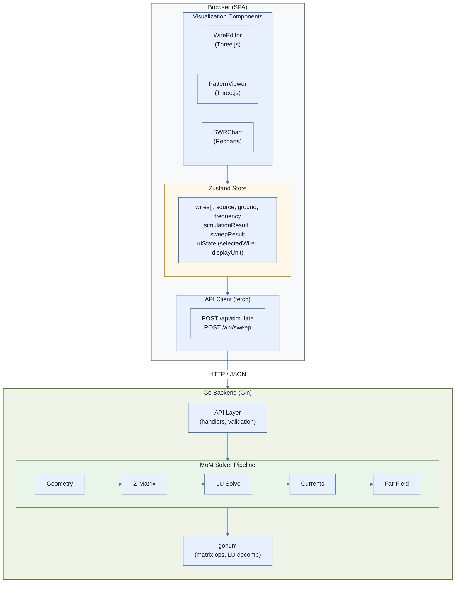

# Antenna Studio — Architecture & Design Document

## 1. Executive Summary

Antenna Studio is a web-based antenna design and simulation tool built on the **Method of Moments (MoM)** electromagnetic solver. Users define wire antenna geometries through a visual 3D editor and tabular input, run simulations against a Go-based MoM solver, and visualize results as 3D radiation patterns, SWR curves, and impedance plots.

The system is a monorepo with two primary components:
- **Frontend**: React (Vite) SPA with Three.js for 3D visualization and Zustand for state management
- **Backend**: Go HTTP server (Gin) hosting a pure-Go MoM solver backed by gonum for linear algebra

---

## 2. System Architecture

### 2.1 High-Level Diagram



### 2.2 Communication Protocol

All frontend-backend communication is **synchronous HTTP REST** (JSON request/response). WebSocket is reserved as a future option for long-running simulations with progress reporting.

| Aspect | Decision |
|---|---|
| Protocol | HTTP/1.1 (upgrade to HTTP/2 via reverse proxy) |
| Serialization | JSON |
| CORS | Backend allows frontend origin in development (`localhost:5173`) |
| Timeout | 30s default; frequency sweeps may take longer, so the sweep endpoint uses 120s |

---

## 3. Backend Architecture (Go)

### 3.1 Package Layout

```
backend/
├── cmd/
│   ├── server/
│   │   └── main.go              # Entry point: wires up Gin, config, starts server
│   └── launcher/
│       └── main.go              # Process launcher: starts backend + frontend together
├── internal/
│   ├── api/
│   │   ├── handlers.go          # HTTP handler functions (Simulate, Sweep, Templates)
│   │   ├── middleware.go         # CORS, request logging, recovery
│   │   ├── request.go           # Request DTOs + validation
│   │   └── response.go          # Response DTOs + serialization helpers
│   ├── geometry/
│   │   ├── wire.go              # Wire struct, validation (non-zero length, positive radius)
│   │   ├── ground.go            # Ground plane config (free-space, perfect, real)
│   │   └── templates.go         # Preset antenna geometries (dipole, Yagi, etc.)
│   ├── mom/
│   │   ├── types.go             # Solver data structures (SimulationInput, SolverResult, etc.)
│   │   ├── segment.go           # Wire → segment subdivision
│   │   ├── green.go             # Green's function, triangle basis kernel (MPIE)
│   │   ├── quadrature.go        # Gauss-Legendre quadrature
│   │   ├── zmatrix.go           # EM constants, legacy pulse-basis matrix (unused)
│   │   ├── solver.go            # Main pipeline: triangle basis, Z-matrix, LU solve
│   │   ├── farfield.go          # Far-field E(θ,φ), gain (free-space + ground)
│   │   ├── ground_image.go      # Image theory for perfect ground plane
│   │   └── ground_real.go       # Lossy ground: Fresnel reflection coefficients
│   └── config/
│       └── config.go            # Server config (port, CORS origins, solver defaults)
├── go.mod
└── go.sum
```

### 3.2 Solver Pipeline — Detailed Flow

```mermaid
%%{init: {'theme': 'base', 'themeVariables': {'primaryColor': '#e8f0fe', 'primaryTextColor': '#1a1a2e', 'primaryBorderColor': '#4a6fa5', 'lineColor': '#4a6fa5', 'background': '#ffffff', 'nodeBorder': '#4a6fa5', 'edgeLabelBackground': '#ffffff'}}}%%
flowchart TD
    IN(["SimulateRequest"])
    V1["1. Validate Geometry<br/>Wire lengths > 0, radius > 0<br/>Segments ≥ 3 (odd), valid source"]
    V2["2. Subdivide Wires<br/>Each wire → N segments with<br/>center, endpoints, half-length, direction"]
    V3["3. Build Triangle Basis<br/>N−1 interior nodes per wire (rooftop)<br/>I = 0 at wire endpoints"]
    V4["4. Build Z-Matrix (M × M)<br/>MPIE: vector potential (triangle-weighted ∫∫ψ)<br/>+ scalar potential (charge × ∫∫ψ)<br/>Gauss-Legendre quadrature (8–16 pt)<br/>Self-terms: reduced kernel + higher order"]
    V4G{"Ground<br/>type?"}
    V4I["Add image contributions<br/>perfect: unity reflection<br/>real: Fresnel Rv/Rh coefficients"]
    V5["5. Build V Vector<br/>V = [0, …, Vs, …, 0]<br/>Vs at feed basis node"]
    V6["6. LU Solve: Z·I = V<br/>2N×2N real system via gonum LU<br/>→ complex current coefficients"]
    V7["7. Compute Results<br/>a) Z_in = Vs / I_feed<br/>b) SWR = (1+|Γ|) / (1−|Γ|)<br/>c) Far-field E(θ,φ) on 2° grid<br/>d) Gain = 4π|E_max|² / P_rad"]
    OUT(["SimulateResponse"])

    IN --> V1 --> V2 --> V3 --> V4
    V4 --> V4G
    V4G -->|"perfect / real"| V4I --> V5
    V4G -->|"free_space"| V5
    V5 --> V6 --> V7 --> OUT

    style IN fill:#fff8e8,stroke:#c4950a,color:#1a1a2e
    style OUT fill:#eaf5ea,stroke:#5a7a3a,color:#1a1a2e
    style V1 fill:#fef0f0,stroke:#c44a4a,color:#1a1a2e
    style V2 fill:#e8f0fe,stroke:#4a6fa5,color:#1a1a2e
    style V3 fill:#e8f0fe,stroke:#4a6fa5,color:#1a1a2e
    style V4 fill:#e8f0fe,stroke:#4a6fa5,color:#1a1a2e
    style V4G fill:#fff8e8,stroke:#c4950a,color:#1a1a2e
    style V4I fill:#f0f4e8,stroke:#5a7a3a,color:#1a1a2e
    style V5 fill:#e8f0fe,stroke:#4a6fa5,color:#1a1a2e
    style V6 fill:#f3e8fe,stroke:#7a4aa5,color:#1a1a2e
    style V7 fill:#eaf5ea,stroke:#5a7a3a,color:#1a1a2e
```



### 3.3 Core Data Structures

```go
// geometry/wire.go
type Wire struct {
    X1, Y1, Z1 float64 // Start point (meters)
    X2, Y2, Z2 float64 // End point (meters)
    Radius      float64 // Wire radius (meters)
    Segments    int     // Number of segments (should be odd for center feed)
}

type GroundConfig struct {
    Type         string  // "free_space" | "perfect" | "real"
    Conductivity float64 // S/m (only for "real")
    Permittivity float64 // Relative (only for "real")
}

type Source struct {
    WireIndex    int     // Index into the wires array
    SegmentIndex int     // Segment on that wire (0-based)
    Voltage      complex128 // Typically 1+0i
}
```

```go
// mom/segment.go
type Segment struct {
    Index      int        // Global segment index
    WireIndex  int        // Which wire this came from
    Center     [3]float64 // Midpoint (x, y, z)
    Start      [3]float64 // Segment start endpoint
    End        [3]float64 // Segment end endpoint
    HalfLength float64    // Half the segment length (Δ/2)
    Direction  [3]float64 // Unit vector along segment
    Radius     float64    // Wire radius (inherited from wire)
}
```

```go
// mom/solver.go
type SolverResult struct {
    Currents    []CurrentEntry  // Per-segment current magnitude & phase
    Impedance   ComplexImpedance
    SWR         float64
    GainDBi     float64
    Pattern     []PatternPoint  // Far-field pattern samples
}

type CurrentEntry struct {
    SegmentIndex int
    Magnitude    float64
    PhaseDeg     float64
}

type ComplexImpedance struct {
    R float64 // Resistance (Ω)
    X float64 // Reactance (Ω)
}

type PatternPoint struct {
    ThetaDeg float64 // Elevation angle (0=zenith, 90=horizon)
    PhiDeg   float64 // Azimuth angle
    GainDB   float64 // Gain in dB relative to isotropic
}
```

### 3.4 Z-Matrix Assembly — Algorithm Detail

The impedance matrix uses the **Mixed Potential Integral Equation (MPIE)** with **triangle (rooftop) basis functions**. Triangle basis was chosen over pulse basis because pulse basis creates delta-function charges at segment endpoints that produce divergent self-potentials for thin wires, making the impedance matrix ill-conditioned.

Each matrix element `Z[m][n]` between triangle basis functions `m` and `n` is:

```
Z[m][n] = jωμ/(4π) · A_mn  +  1/(jωε·4π) · Φ_mn
```

**Vector potential term** (A_mn):
```
A_mn = Σ_{a∈m} Σ_{b∈n} (ŝa·ŝb) ∫∫ φ_m(s)·φ_n(s')·ψ(R) ds ds'
```

**Scalar potential term** (Φ_mn):
```
Φ_mn = Σ_{a∈m} Σ_{b∈n} ρ_a·ρ_b ∫∫ ψ(R) ds ds'
```

Where:
- `ψ(R) = e^{-jkR} / R` is the reduced Green's function
- `φ_m, φ_n` are piecewise-linear current shape functions (triangle basis)
- `ρ_a, ρ_b` are piecewise-constant charge densities (`±1/Δl`)
- The sums are over the 1–2 segments that each basis function spans

**Implementation approach**:
1. Each basis function spans up to 2 segments → up to 4 segment-pair integrals per `Z[m][n]`
2. Double Gauss-Legendre quadrature per segment pair (8 points standard, 16 for self-terms)
3. **Self-terms**: use reduced kernel `R = sqrt(r² + a²)` where `a` = wire radius
4. **Parallelization**: goroutine worker pool (`runtime.NumCPU()` workers) fills the matrix concurrently

### 3.5 Far-Field Computation

For each angular sample point `(θ, φ)`:

```
E(θ,φ) = Σᵢ Iᵢ · Δlᵢ · ŝᵢ × (ŝᵢ × r̂) · e^{jk(r̂·rᵢ)} · (-jωμ/4πr)
```

Simplification: compute on a unit sphere (`r = 1`, drop the `1/r` for pattern shape).

**Angular grid**: Default to 2° resolution → 91 θ values × 181 φ values = 16,471 points. Return as a flat array of `PatternPoint` structs for the frontend to render.

**Ground plane**: For any non-free-space ground, the pattern is restricted to the upper hemisphere (θ ≤ 90°). Image segment contributions are added to the far-field sum:
- **Perfect ground** (`ComputeFarFieldWithGround`): image contributes with unity reflection coefficient. Total power = upper hemisphere integral only (no doubling — the image field already appears in the upper hemisphere).
- **Real ground** (`ComputeFarFieldRealGround`): image contributions scaled by angle-dependent Fresnel reflection coefficients Rv (vertical) and Rh (horizontal), blended by current orientation. Lossy ground absorbs power, so total power = upper hemisphere integral without doubling.

### 3.6 Frequency Sweep

The `/api/sweep` endpoint repeats the full solver pipeline for each frequency step:

```
for each freq in linspace(freq_start, freq_end, freq_steps):
    k = 2π·freq / c
    rebuild Z-matrix (frequency-dependent via k)
    solve Z·I = V
    compute impedance, SWR at this freq
```

**Optimization**: The geometry and segmentation are frequency-independent — only rebuild them once. The Z-matrix must be rebuilt at each frequency because the Green's function depends on `k`.

**Parallelization**: Each frequency point is independent. Use a goroutine worker pool to solve multiple frequencies concurrently. For 50 frequency steps on an 8-core machine, expect ~6x speedup.

### 3.7 Ground Plane Implementation

#### Phase 1: Perfect Ground (Image Theory)

For a perfect ground at `z = 0`:
- For every real segment at position `(x, y, z)`, create an image segment at `(x, y, -z)`
- Image currents are inverted for horizontal components, preserved for vertical
- Add image segment contributions to the Z-matrix (doubles the integration work, but no additional unknowns)

#### Phase 2: Real (Lossy) Ground — Fresnel Reflection Coefficients

Implemented using the **reflection-coefficient image method** (same approach as MININEC/EZNEC). Instead of full Sommerfeld integration, each image contribution is scaled by an angle-dependent Fresnel coefficient:

**Complex permittivity**: `εc = εr − jσ/(ωε₀)`

**Fresnel coefficients** at grazing angle ψ:
- Vertical (TM): `Rv = (εc·sinψ − √(εc − cos²ψ)) / (εc·sinψ + √(εc − cos²ψ))`
- Horizontal (TE): `Rh = (sinψ − √(εc − cos²ψ)) / (sinψ + √(εc − cos²ψ))`

**Z-matrix** (`addRealGroundTriangleBasis`): computes the quasi-static angle from the source-image geometry, blends Rv/Rh by current orientation, and scales the image kernel contribution by the effective reflection coefficient.

**Far-field** (`ComputeFarFieldRealGround`): applies per-angle Fresnel coefficients to image segment contributions, with ψ = π/2 − θ.

**Limits**: approaches perfect ground as σ → ∞ (validated in tests). Less accurate for horizontal wires within λ/10 of the ground surface.

---

## 4. Frontend Architecture (React)

### 4.1 Component Tree

```
<App>
├── <Header>
│   ├── <ProjectName>
│   ├── <TemplateSelector>          # Dropdown: Dipole, Yagi, Vertical, Loop, Custom
│   ├── <SaveButton>                # Export design as JSON file
│   ├── <LoadButton>                # Import design from JSON file
│   ├── <SimulateButton>            # Single-frequency simulation
│   └── <SweepButton>               # Frequency sweep
│
├── <MainLayout>                     # Resizable split panels with collapse toggle
│   ├── <LeftPanel>
│   │   ├── <WireTable>             # Tabular wire input with unit selector (m/ft/in/cm/mm)
│   │   │   ├── <WireRow>           # Editable row with unit conversion
│   │   │   └── <AddWireButton>
│   │   ├── <SourceConfig>          # Feed point: wire index, segment, voltage
│   │   ├── <GroundConfig>          # Ground type (free/perfect/real) + material params
│   │   └── <FrequencyInput>        # Single freq or sweep range
│   │
│   └── <RightPanel>                 # Tabbed visualization area
│       ├── <Tab: 3D Editor>
│       │   └── <WireEditor>        # Three.js 3D canvas (Z-up → Y-up coord mapping)
│       ├── <Tab: Radiation Pattern>
│       │   └── <PatternViewer>     # 3D pattern mesh (ground suppression, ground plane visual)
│       ├── <Tab: SWR Chart>
│       │   └── <SWRChart>          # Auto log-scale SWR vs frequency
│       ├── <Tab: Impedance>
│       │   └── <ImpedanceChart>    # R,X dual Y-axes vs frequency
│       ├── <Tab: Currents>
│       │   └── <CurrentDisplay>    # Segment current bar chart + table
│       └── <Tab: Matching>
│           └── <MatchingNetwork>   # L/Pi/Toroidal matching network designer
│
└── <StatusBar>                      # Simulation status, impedance, SWR, gain
```

### 4.2 Zustand Store Design

```typescript
// store/antennaStore.ts

interface Wire {
  id: string;           // UUID for React keys
  x1: number; y1: number; z1: number;
  x2: number; y2: number; z2: number;
  radius: number;       // meters
  segments: number;     // integer, preferably odd
}

interface Source {
  wireIndex: number;
  segmentIndex: number;
  voltage: number;
}

interface GroundConfig {
  type: 'free_space' | 'perfect' | 'real';
  conductivity: number;
  permittivity: number;
}

interface FrequencyConfig {
  mode: 'single' | 'sweep';
  frequencyMhz: number;     // For single mode
  freqStart: number;        // For sweep mode
  freqEnd: number;
  freqSteps: number;
}

interface PatternPoint {
  theta: number;
  phi: number;
  gainDb: number;
}

interface SimulationResult {
  impedance: { r: number; x: number };
  swr: number;
  gainDbi: number;
  pattern: PatternPoint[];
  currents: { segment: number; magnitude: number; phase: number }[];
}

interface SweepResult {
  frequencies: number[];
  swr: number[];
  impedance: { r: number; x: number }[];
}

interface AntennaStore {
  // --- Geometry State ---
  wires: Wire[];
  source: Source;
  ground: GroundConfig;
  frequency: FrequencyConfig;

  // --- Results State ---
  simulationResult: SimulationResult | null;
  sweepResult: SweepResult | null;

  // --- UI State ---
  selectedWireId: string | null;
  displayUnit: DisplayUnit;    // 'meters' | 'feet' | 'inches' | 'cm' | 'mm'
  isSimulating: boolean;
  error: string | null;

  // --- Actions ---
  addWire: (wire: Omit<Wire, 'id'>) => void;
  updateWire: (id: string, updates: Partial<Wire>) => void;
  removeWire: (id: string) => void;
  setSource: (source: Source) => void;
  setGround: (ground: GroundConfig) => void;
  setFrequency: (freq: FrequencyConfig) => void;
  selectWire: (id: string | null) => void;
  loadTemplate: (templateName: string) => void;
  runSimulation: () => Promise<void>;
  runSweep: () => Promise<void>;
}
```

### 4.3 Component Specifications

#### 4.3.1 WireEditor (Three.js 3D Canvas)

**Purpose**: Interactive 3D visualization and editing of wire antenna geometry.

**Rendering**:
- Each wire rendered as a `THREE.CylinderGeometry` (or `TubeGeometry` for curved paths) between its two endpoints
- Wire endpoints shown as small spheres (drag handles)
- Ground plane shown as a semi-transparent grid at `z = 0` when ground is not `free_space`
- Axis helper (X=red, Y=green, Z=blue) in corner
- Feed point indicated by a colored marker (e.g., red arrow) on the source segment

**Interaction**:
- Orbit controls (rotate, zoom, pan) via `OrbitControls`
- Click wire to select it (highlights in store, syncs with WireTable)
- Drag endpoints to move them (updates store, snaps to grid optionally)
- Right-click context menu: delete wire, set as feed point

**Camera**: Default isometric view. Buttons to snap to front/side/top views.

**Implementation**: Use `@react-three/fiber` and `@react-three/drei` for React-friendly Three.js integration.

#### 4.3.2 PatternViewer (3D Radiation Pattern)

**Purpose**: Visualize the 3D radiation pattern as a colored surface.

**Rendering**:
- Convert `PatternPoint[]` (θ, φ, gain_dB) to a 3D surface mesh
- For each (θ, φ): `r = gain_linear`, then spherical → Cartesian
- Color map: gain_dB mapped to a colorscale (jet/viridis) applied as vertex colors
- Wireframe overlay option for clarity
- Antenna geometry shown as thin lines at the center for reference

**Controls**:
- Orbit controls (rotate, zoom)
- Toggle between 3D surface and 2D polar cuts (E-plane, H-plane)
- Gain scale selector (dBi, dBd, linear)
- Max gain label displayed

#### 4.3.3 SWRChart (Recharts Line Chart)

**Purpose**: Plot SWR vs. frequency from sweep results.

**Features**:
- X-axis: frequency (MHz)
- Y-axis: auto-switches between linear and **log scale** when the SWR range exceeds 10:1
- Log scale uses custom ticks at meaningful values (1, 2, 5, 10, 50, 100, 1k, 10k)
- Reference lines at SWR 2:1 (orange dashed) and 3:1 (grey dashed)
- Tooltip shows the actual unclamped SWR value on hover
- Responsive sizing

#### 4.3.4 ImpedanceChart

**Purpose**: Plot R (resistance) and X (reactance) vs. frequency.

**Features**:
- **Dual Y-axes**: R (orange, left axis) and X (cyan dashed, right axis) scale independently — prevents large X values from squashing the R trace
- X-axis: frequency (MHz)
- Reference line at X = 0 on the reactance axis (resonance indicator)
- Tooltip with R + jX formatted display

#### 4.3.5 MatchingNetwork (Impedance Matching Designer)

**Purpose**: Design matching networks to transform simulated antenna impedance to the transmitter impedance (configurable, default 50 Ω).

**Network types** (selectable via sub-tabs):
- **L-Network**: two solutions (low-pass and high-pass) with series/shunt topology, Q factor, bandwidth estimate, and ASCII schematic
- **Pi-Network**: three-element shunt-series-shunt design with configurable Q
- **Toroidal Transformer**: turns ratio calculation with recommended toroid cores (T-37 through T-106 iron powder, FT-37/50/82 ferrite), primary/secondary turns, and inductance values

**Features**:
- Antenna impedance sourced directly from the simulation result
- All component values shown as exact AND nearest E12 standard values
- Reactance cancellation notes when the antenna has significant jX
- Core table with material type, turns count, inductance, and frequency range

**Implementation**: Pure frontend calculation (`utils/matching.ts`) — no backend API needed. Uses the standard L-network design equations with Q-factor analysis.

### 4.4 API Client Layer

```typescript
// api/client.ts

const API_BASE = import.meta.env.VITE_API_BASE || 'http://localhost:8080';

interface SimulateRequest {
  wires: WireDTO[];
  frequency_mhz: number;
  ground: GroundDTO;
  source: SourceDTO;
}

interface SweepRequest extends SimulateRequest {
  freq_start: number;
  freq_end: number;
  freq_steps: number;
}

export async function simulate(req: SimulateRequest): Promise<SimulationResult> {
  const res = await fetch(`${API_BASE}/api/simulate`, {
    method: 'POST',
    headers: { 'Content-Type': 'application/json' },
    body: JSON.stringify(req),
  });
  if (!res.ok) {
    const err = await res.json();
    throw new Error(err.error || 'Simulation failed');
  }
  return res.json();
}

export async function sweep(req: SweepRequest): Promise<SweepResult> {
  const res = await fetch(`${API_BASE}/api/sweep`, {
    method: 'POST',
    headers: { 'Content-Type': 'application/json' },
    body: JSON.stringify(req),
    signal: AbortSignal.timeout(120_000), // 2 minute timeout for sweeps
  });
  if (!res.ok) {
    const err = await res.json();
    throw new Error(err.error || 'Sweep failed');
  }
  return res.json();
}
```

---

## 5. API Contract

### 5.1 POST /api/simulate

Run a single-frequency MoM simulation.

**Request Body**:
```json
{
  "wires": [
    {
      "x1": 0, "y1": 0, "z1": 0,
      "x2": 0, "y2": 0, "z2": 1.0,
      "radius": 0.001,
      "segments": 11
    }
  ],
  "frequency_mhz": 14.0,
  "ground": {
    "type": "perfect",
    "conductivity": 0.005,
    "permittivity": 13
  },
  "source": {
    "wire_index": 0,
    "segment_index": 5,
    "voltage": 1.0
  }
}
```

**Validation Rules**:
| Field | Rule |
|---|---|
| `wires` | Non-empty array, max 100 wires |
| `wires[].x1..z2` | Finite floats; start != end (non-zero length) |
| `wires[].radius` | > 0, < segment_length/4 (thin-wire approximation) |
| `wires[].segments` | Integer ≥ 1, ≤ 200 |
| `frequency_mhz` | > 0, ≤ 30000 (30 GHz practical limit) |
| `ground.type` | One of: `free_space`, `perfect`, `real` |
| `source.wire_index` | Valid index into wires array |
| `source.segment_index` | Valid index for that wire's segment count |

**Response Body** (200 OK):
```json
{
  "impedance": { "r": 73.1, "x": 42.5 },
  "swr": 2.1,
  "gain_dbi": 8.3,
  "pattern": [
    { "theta": 0, "phi": 0, "gain_db": 2.1 },
    { "theta": 2, "phi": 0, "gain_db": 2.3 }
  ],
  "currents": [
    { "segment": 0, "magnitude": 0.013, "phase": -12.3 },
    { "segment": 1, "magnitude": 0.019, "phase": -8.7 }
  ]
}
```

**Error Response** (400/500):
```json
{
  "error": "wire 0: radius exceeds thin-wire limit for given segment length"
}
```

### 5.2 POST /api/sweep

Run the solver across a frequency range.

**Request Body**: Same as `/simulate` plus:
```json
{
  "freq_start": 14.0,
  "freq_end": 14.35,
  "freq_steps": 50
}
```

**Additional Validation**:
| Field | Rule |
|---|---|
| `freq_start` | > 0 |
| `freq_end` | > `freq_start` |
| `freq_steps` | Integer 2–500 |

**Response Body** (200 OK):
```json
{
  "frequencies": [14.0, 14.007, 14.014],
  "swr": [1.8, 1.7, 1.65],
  "impedance": [
    { "r": 73.1, "x": 42.5 },
    { "r": 72.8, "x": 38.2 },
    { "r": 72.5, "x": 34.1 }
  ]
}
```

### 5.3 GET /api/templates

Return available antenna preset templates.

**Response Body** (200 OK):
```json
{
  "templates": [
    {
      "name": "Half-Wave Dipole",
      "description": "Center-fed half-wave dipole for given frequency",
      "parameters": [
        { "name": "frequency_mhz", "type": "number", "default": 14.0 }
      ]
    },
    {
      "name": "3-Element Yagi",
      "description": "3-element Yagi-Uda beam antenna",
      "parameters": [
        { "name": "frequency_mhz", "type": "number", "default": 14.0 },
        { "name": "boom_height_m", "type": "number", "default": 10.0 }
      ]
    }
  ]
}
```

### 5.4 POST /api/templates/{name}

Generate wire geometry from a template with given parameters.

**Response**: Returns the full wires/source/ground config to load into the editor.

---

## 6. Antenna Templates

Pre-built antenna geometries that auto-generate wires, source, and ground config.

| Template | Wires | Source | Default Ground |
|---|---|---|---|
| Half-Wave Dipole | 1 vertical wire, length = λ/2 | Center segment | Free space |
| Quarter-Wave Vertical | 1 vertical wire, length = λ/4 | Base segment | Perfect |
| 3-Element Yagi | 3 parallel wires (reflector, driven, director) | Center of driven | Free space |
| Inverted-V Dipole | 2 wires from apex angled down | Junction segment | Perfect |
| Full-Wave Loop | 4 wires forming a square, perimeter = λ | Middle of bottom wire | Free space |

**Template generation formula** (example — half-wave dipole):
```
λ = 300 / frequency_mhz  (meters)
wire_length = λ / 2
wire: (0, 0, -wire_length/2) → (0, 0, +wire_length/2)
segments: nearest odd number to (wire_length / (λ/20))
source: center segment
```

---

## 7. Project Structure

```
antenna-studio/
├── frontend/
│   ├── src/
│   │   ├── components/
│   │   │   ├── layout/
│   │   │   │   ├── Header.tsx             # Title, template selector, simulate/sweep buttons
│   │   │   │   ├── MainLayout.tsx         # Resizable split panel with collapse toggle
│   │   │   │   └── StatusBar.tsx          # Simulation status, impedance, SWR, gain
│   │   │   ├── editor/
│   │   │   │   └── WireEditor.tsx         # Three.js 3D canvas (Z-up → Y-up mapping)
│   │   │   ├── input/
│   │   │   │   ├── WireTable.tsx          # Wire table with unit selector (m/ft/in/cm/mm)
│   │   │   │   ├── WireRow.tsx            # Editable row with unit conversion
│   │   │   │   ├── SourceConfig.tsx       # Feed point: wire, segment, voltage
│   │   │   │   ├── GroundConfig.tsx       # Ground type + material params
│   │   │   │   ├── FrequencyInput.tsx     # Single / sweep mode toggle
│   │   │   │   └── TemplateSelector.tsx   # Preset antenna dropdown
│   │   │   ├── results/
│   │   │   │   ├── PatternViewer.tsx      # 3D radiation pattern (ground suppression)
│   │   │   │   ├── SWRChart.tsx           # SWR vs frequency (auto log-scale)
│   │   │   │   ├── ImpedanceChart.tsx     # R,X vs frequency (dual Y-axes)
│   │   │   │   ├── CurrentDisplay.tsx     # Segment currents bar chart + table
│   │   │   │   └── MatchingNetwork.tsx    # L/Pi/Toroidal impedance matching designer
│   │   │   └── common/
│   │   │       ├── NumericInput.tsx        # Labeled number input
│   │   │       └── ColorScale.tsx         # Gain colormap legend bar
│   │   ├── store/
│   │   │   └── antennaStore.ts            # Zustand store (wires, source, ground, results, UI)
│   │   ├── api/
│   │   │   └── client.ts                  # Backend API calls + camelCase↔snake_case mapping
│   │   ├── utils/
│   │   │   ├── conversions.ts             # Spherical↔Cartesian, Z-up→Y-up, dB↔linear, units
│   │   │   ├── validation.ts              # Client-side wire/frequency validation
│   │   │   └── matching.ts               # Matching network calculator (L, Pi, toroidal)
│   │   ├── types/
│   │   │   └── index.ts                   # Shared interfaces, DisplayUnit, METERS_TO_UNIT
│   │   ├── App.tsx
│   │   └── main.tsx
│   ├── index.html
│   ├── vite.config.ts                      # React plugin, /api proxy to backend
│   ├── tsconfig.json
│   ├── nginx.conf                          # Production reverse proxy config
│   ├── Dockerfile
│   └── package.json
│
├── backend/
│   ├── cmd/
│   │   ├── server/main.go                 # Gin HTTP server entry point
│   │   └── launcher/main.go               # Process launcher (backend + frontend)
│   ├── internal/
│   │   ├── api/                           # HTTP handlers, DTOs, middleware
│   │   ├── geometry/                      # Wire validation, ground validation, 5 templates
│   │   ├── mom/                           # MoM solver (triangle basis, MPIE, far-field, Fresnel ground)
│   │   └── config/                        # Server configuration from env vars
│   ├── Dockerfile
│   ├── go.mod
│   └── go.sum
│
├── docker-compose.yml
├── Makefile                                # run, dev-backend, dev-frontend, build, test
├── kill-all.sh                             # Kill all running backend/frontend processes
├── ARCHITECTURE.md
└── README.md
```

---

## 8. Build Order & Milestones

### Phase 1: Skeleton (Milestone: end-to-end data flow with mock data)

| Step | Task | Deliverable |
|---|---|---|
| 1.1 | Go backend scaffold | Gin server, `/api/simulate` returns hardcoded JSON |
| 1.2 | React frontend scaffold | Vite app, WireTable, calls stub API, displays raw JSON |
| 1.3 | Three.js WireEditor | Renders wires from store as 3D cylinders |
| 1.4 | Connect store to API | WireTable edits → store → API call → result displayed |

### Phase 2: Core Solver (Milestone: correct simulation for simple dipole)

| Step | Task | Deliverable |
|---|---|---|
| 2.1 | Segment subdivision | `segment.go` — wires subdivided, unit tests |
| 2.2 | Green's function | `green.go` — free-space Green's function, unit tests |
| 2.3 | Quadrature | `quadrature.go` — Gauss-Legendre wrapper, validated against known integrals |
| 2.4 | Z-matrix assembly | `zmatrix.go` — builds N×N complex matrix, validated for 1-wire case |
| 2.5 | LU solver | `solver.go` — gonum LU decomp, returns current vector |
| 2.6 | Feed impedance + SWR | Compute from I at feed segment, validate against known dipole (~73+j42 Ω) |

### Phase 3: Visualization (Milestone: 3D pattern + SWR chart working)

| Step | Task | Deliverable |
|---|---|---|
| 3.1 | Far-field calculation | `farfield.go` — E(θ,φ) grid, gain computation |
| 3.2 | PatternViewer | Three.js 3D radiation pattern surface |
| 3.3 | Frequency sweep | `/api/sweep` endpoint, loops solver over freq range |
| 3.4 | SWR Chart | Recharts SWR vs. frequency plot |
| 3.5 | Impedance Chart | Recharts R,X vs. frequency plot |

### Phase 4: Ground & Templates (Milestone: practical antenna modeling)

| Step | Task | Deliverable |
|---|---|---|
| 4.1 | Perfect ground (image theory) | `ground_image.go`, validated vertical antenna over ground |
| 4.2 | Antenna templates | Dipole, vertical, Yagi, loop presets |
| 4.3 | Template selector UI | Dropdown + parameter form, loads into editor |

### Phase 5: Polish (Milestone: release-ready)

| Step | Task | Deliverable |
|---|---|---|
| 5.1 | NEC2 export | Generate `.nec` deck file from current geometry |
| 5.2 | NEC2 import | Parse `.nec` file, load into editor |
| 5.3 | Save/load designs | JSON export/import of full antenna config |
| 5.4 | 2D polar pattern cuts | E-plane and H-plane polar plots |
| 5.5 | Current visualization | Color-coded current magnitude on wire segments |
| 5.6 | Docker packaging | `docker-compose.yml` for frontend + backend |

---

## 9. Validation & Testing Strategy

### 9.1 Backend Testing

**86 unit tests** across 4 packages, run with `go test ./...`:

- `mom/solver_test.go` (4 tests) — half-wave dipole impedance/SWR/gain, Gauss-Legendre integration, wire subdivision, frequency sweep
- `mom/mom_test.go` (26 tests) — Green's function, psi, dist with/without reduced kernel, TriangleKernel self/mutual terms, far-field sin²(θ) pattern + ground restriction, image theory for vertical/horizontal/diagonal wires, segment properties, quadrature accuracy/symmetry/caching
- `mom/ground_real_test.go` (6 tests) — complex permittivity, Fresnel coefficient limits (perfect conductor, normal incidence, grazing angle), high-conductivity continuity with perfect ground, real vs perfect ground comparison
- `geometry/geometry_test.go` (24 tests) — WireLength, ValidateWire (5 cases), ValidateGround (9 cases), GetTemplates count, all 5 template generators with default + custom params + error cases
- `api/api_test.go` (13 tests) — SimulateRequest.Validate (10 validation cases), SweepRequest.ToSimulateRequest conversion, SolverResultToResponse + SweepResultToResponse field mapping
- `config/config_test.go` (3 tests) — default config, PORT override, CORS_ORIGINS parsing

**Reference validation** (verified in tests):
- Half-wave dipole at 300 MHz: R ≈ 83.5 Ω, X ≈ 42.0 Ω, gain = 2.15 dBi
- Short dipole far-field: sin²(θ) pattern shape, null at poles, max at θ=90°
- Pattern with ground: upper hemisphere only, gain ≈ 5 dBi for quarter-wave monopole
- Real ground high-conductivity limit matches perfect ground within 0.2 dB

---

## 10. Performance Considerations

| Concern | Mitigation |
|---|---|
| Z-matrix is O(N²) to build | Parallelize with goroutine worker pool; exploit symmetry (compute upper triangle only) |
| LU decomposition is O(N³) | gonum uses optimized BLAS; for N < 500 segments, this is sub-second |
| Frequency sweep repeats full solve | Parallelize across frequencies; geometry subdivision done once |
| Far-field grid can be large | Default 2° resolution (16K points); allow user to select coarser grid |
| Frontend rendering large pattern mesh | Use `BufferGeometry` with vertex colors; avoid re-creating mesh on orbit |
| JSON payload size for pattern | ~16K points × 24 bytes ≈ 400KB; acceptable for HTTP; compress with gzip |

**Practical limits**: The system targets antennas with up to ~500 total segments. Beyond that, the O(N³) LU decomposition becomes the bottleneck. This covers most wire antennas including multi-element Yagis and loop antennas.

---

## 11. Deployment

### Development

**Single command** (recommended):
```bash
make run    # starts both backend + frontend via the launcher
```

The launcher manages both processes, prefixes output with `[backend]`/`[frontend]`, and supports Ctrl+C to restart or double Ctrl+C to quit.

**Separate terminals**:
```bash
cd backend && go run ./cmd/server    # Terminal 1
cd frontend && npm run dev           # Terminal 2
```

Vite dev server proxies `/api/*` to `localhost:8080` (configure in `vite.config.ts`).

### Production (Docker Compose)

```yaml
# docker-compose.yml
services:
  backend:
    build: ./backend
    ports:
      - "8080:8080"
    environment:
      - PORT=8080
      - CORS_ORIGIN=http://localhost:3000

  frontend:
    build: ./frontend
    ports:
      - "3000:80"
    depends_on:
      - backend
    environment:
      - VITE_API_BASE=http://backend:8080
```

**Frontend Dockerfile**: Multi-stage build — `node` stage for `npm run build`, then `nginx` to serve static files.

**Backend Dockerfile**: Multi-stage build — `golang` stage for `go build`, then `scratch` or `alpine` for minimal runtime image.

---

## 12. Future Enhancements

- **WebSocket progress**: Report % complete during long sweeps
- **Wire loading**: Lumped loads (R, L, C) on segments
- **Transmission lines**: Model feedlines with loss and velocity factor
- **Optimization**: Auto-tune wire lengths/positions to minimize SWR
- **Multi-band sweep**: Discontinuous frequency ranges
- **NEC2 import/export**: Read and write `.nec` deck files
- **2D polar plots**: E-plane and H-plane pattern cuts
- **NEC4 compatibility**: Extended thin-wire kernel, stepped-radius junctions
- **Full Sommerfeld integration**: For horizontal wires very close to lossy ground (within λ/10)
